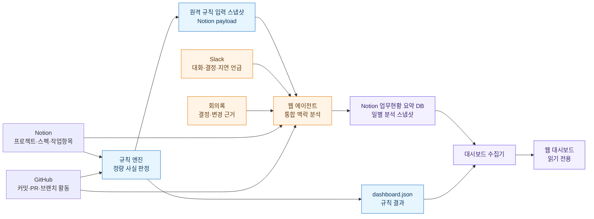
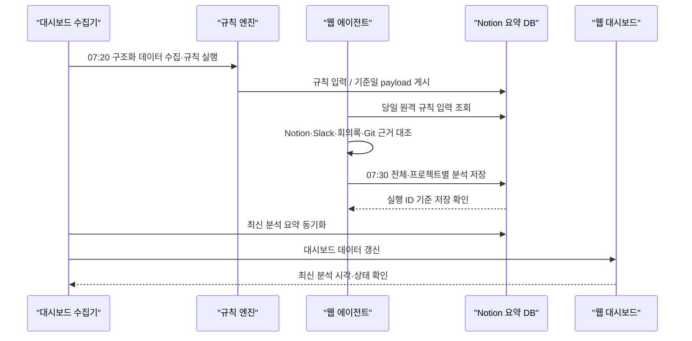

# 업무 대시보드 — 웹 에이전트 + 규칙 엔진 하이브리드 설계

작성일: 2026-07-21
상태: 구현 전 설계안

## 1. 결론

**ChatGPT 웹 에이전트가 Notion·Slack·Git·회의록을 통합 분석**하고, 현재 대시보드의 **규칙 엔진이 수치와 가이드 위반을 판정**하는 하이브리드 방식이 가장 적합하다.

두 기능은 대체 관계가 아니다.

- 규칙 엔진은 완료율, 기한 초과, 날짜 누락처럼 같은 데이터에 항상 같은 결과가 나와야 하는 사실을 담당한다.
- 에이전트는 Slack 대화와 회의록의 맥락, 서로 다른 출처의 주장, 현재 막힌 이유처럼 자연어 이해가 필요한 부분을 담당한다.
- 둘의 결과가 다르면 어느 한쪽이 다른 쪽을 덮어쓰지 않고, 원문 근거와 함께 `확인 필요`로 표시한다.

이 구조의 핵심은 **AI가 숫자를 계산하는 시스템**이 아니라, **규칙이 만든 사실 위에서 AI가 맥락을 설명하는 시스템**을 만드는 것이다.

## 2. 목표와 비목표

### 목표

대표가 첫 화면에서 다음 질문에 빠르게 답할 수 있어야 한다.

1. 프로젝트와 각 스프린트는 얼마나 진행됐는가?
2. 어떤 작업이 기한을 넘겼거나 관리 가이드를 위반했는가?
3. Notion 기록과 Slack·회의록·Git 활동이 서로 맞는가?
4. 지금 막힌 원인과 후속 영향은 무엇인가?
5. 오늘 확인하거나 판단해야 할 내용은 무엇인가?
6. 어떤 출처가 수집되지 않아 현재 분석을 믿기 어려운가?

### 비목표

- Git 활동만으로 Notion 작업 상태를 자동 변경하지 않는다.
- 에이전트가 업무 완료율, 초과 일수, 위반 건수를 임의 계산하지 않는다.
- 출처 충돌을 에이전트가 임의로 해결하거나 최신 정보로 단정하지 않는다.
- 대시보드에서 Notion 원본 작업을 자동 수정하지 않는다.
- 담당자 성과나 생산성 점수를 만들지 않는다.

## 3. 권장 전체 구조



## 4. 현재 방식에서 바뀌는 점

| 구분 | 현재 | 변경 후 |
| --- | --- | --- |
| 정량 판정 | 코드의 규칙 엔진 | 그대로 유지 |
| Slack·회의록 맥락 해석 | 직접 OpenAI API가 필요하거나 미실행 | 웹 에이전트가 연결 소스로 분석 |
| AI 결과 저장 | 로컬 JSON 중심 | Notion 업무현황 요약 DB에 일별 저장 |
| 웹 표시 | 규칙 결과와 일부 기존 요약 | 최신 규칙 결과 + 최신 성공한 에이전트 분석 병합 |
| AI 비용 경로 | `OPENAI_API_KEY` 사용 시 별도 API 과금 | ChatGPT/Codex 이용 한도 사용, 별도 API 호출 제거 |
| 실패 처리 | AI 미실행과 충돌 없음이 혼동될 수 있음 | `미실행 / 부분 성공 / 성공 / 실패`를 구분 |

현재 추가된 직접 OpenAI API 요약 기능은 운영 기본 경로로 사용하지 않는다. 향후 필요할 때만 선택 가능한 대체 제공자로 남기거나, 구현 시 제거 여부를 별도로 결정한다.

## 5. 책임 경계

### 5.1 규칙 엔진이 판단할 내용

규칙 엔진 결과는 재현 가능한 구조화 데이터여야 한다.

- 프로젝트·스프린트·스펙·작업항목 계층
- 스프린트별 완료율
- 진행 중 작업항목 수
- 기한 초과 여부와 초과 일수
- 시작일·마감일·완료일·담당자 누락
- 3단계 이상 계층 등 가이드 위반
- 상위·하위 상태 불일치
- 완료 후 재작업 의심
- Git 최근 활동 시각과 Notion 상태의 기계적 불일치 후보
- 출처별 수집 성공 여부와 데이터 커버리지

규칙 결과에는 `판정 규칙 ID`, `현재 값`, `판정 시각`, `근거 링크`를 포함한다.

### 5.2 웹 에이전트가 분석할 내용

- 프로젝트와 스프린트가 실제로 무엇을 진행 중인지 문장으로 요약
- Slack·회의록에서 결정, 변경, 지연, 대기, 요청 내용을 추출
- Notion·Slack·회의록·Git의 주장이 서로 다른지 대조
- 막힌 원인과 영향을 받는 후속 작업 설명
- 대표가 확인할 질문 후보 정리
- 어제 분석과 비교해 의미 있게 달라진 내용 설명
- 규칙 엔진이 만든 문제에 실무적인 조치 문구 부여

에이전트는 모든 결론에 출처를 붙인다. Slack과 회의록에서 가져온 주장은 항상 `미확인 주장`으로 시작하며, Notion 원본 상태를 변경하지 않는다.

### 5.3 웹 대시보드가 담당할 내용

- 규칙 결과와 에이전트 분석 결과 병합
- 스프린트 완료율과 기한 초과는 규칙 결과만 표시
- 통합 요약과 출처 충돌은 에이전트 결과 표시
- 최신 분석이 없거나 일부 출처 수집이 실패하면 명확한 열화 상태 표시
- 사용자가 원문으로 이동할 수 있는 링크 제공

## 6. 하루 한 번 실행되는 워크플로우

권장 실행 시각은 대한민국 영업일 오전이며, 기준 시간대는 `Asia/Seoul`이다.



대시보드 수집기와 웹 에이전트는 분리해 실행한다. 수집기는 로컬 또는 배포 서버에서 규칙 엔진을 실행하고 축약된 정량 결과를 Notion에 게시한다. 웹 에이전트는 로컬 파일과 터미널에 접근하지 않고 Notion의 당일 규칙 입력 페이지와 연결된 Notion·Slack·GitHub만 사용한다.

### 실행 단계

1. `collect.mjs --no-ai`가 Notion과 Git을 수집하고 규칙을 실행한다.
2. 수집기는 `업무현황 요약 DB`에 `규칙 입력 / YYYY-MM-DD` 원격 스냅샷을 게시한다.
3. 웹 에이전트가 원격 payload와 연결된 Notion·Slack·Git 도구를 사용해 통합 분석한다.
4. 에이전트가 `업무현황 요약 DB`에 분석 결과를 저장한다.
5. 수집기가 최신 성공 분석을 다시 읽어 `dashboard.json`과 병합한다.
6. 웹 대시보드는 새 데이터를 읽어 표시한다.

동일 날짜에 재실행할 때는 새 행을 계속 만들지 않고 `실행 키`가 같은 행을 갱신한다. 다음 날짜가 되면 새 스냅샷을 만든다.

## 7. 분석 입력 패킷

원본 전체를 에이전트에 무제한 전달하지 않는다. 규칙 엔진이 분석 범위를 좁혀 Notion 원격 payload로 게시한다. 로컬의 `data/agent-input.json`은 진단용이며 웹 에이전트가 읽지 않는다.

```json
{
  "schemaVersion": "1.0",
  "runId": "2026-07-21-morning",
  "generatedAt": "2026-07-21T07:20:00+09:00",
  "sourceStatus": {
    "notion": "success",
    "slack": "pending_agent",
    "git": "partial",
    "meetingNotes": "pending_agent"
  },
  "projects": [
    {
      "projectId": "...",
      "projectName": "피자레디",
      "sprints": [],
      "ruleIssues": [],
      "changedWorkItems": [],
      "gitActivityCandidates": []
    }
  ]
}
```

에이전트가 Slack에서 우선 찾아볼 범위는 다음으로 제한한다.

- 전일 대비 변경된 스펙
- 기한 초과 또는 가이드 위반이 있는 스펙
- Git 활동과 Notion 기록이 불일치한 스펙
- 최근 회의록에서 언급된 스펙
- 명시적인 프로젝트명·스펙명·작업항목 ID가 있는 대화

이렇게 해야 분석 시간이 줄고, 관련 없는 Slack 대화를 잘못 연결하는 위험도 낮아진다.

## 8. 에이전트 출력 계약

에이전트는 자유 형식 보고서가 아니라 다음 스키마에 맞춘 결과를 만든다.

```json
{
  "schemaVersion": "1.0",
  "runId": "2026-07-21-morning",
  "generatedAt": "2026-07-21T07:30:00+09:00",
  "analysisStatus": "success",
  "sourceStatus": {},
  "overall": {
    "summary": "...",
    "decisionsToReview": [],
    "changesSinceYesterday": [],
    "confidenceLimits": []
  },
  "projects": [
    {
      "projectId": "...",
      "projectName": "피자레디",
      "summary": "...",
      "sprintSummaries": [],
      "blockers": [],
      "sourceConflicts": [
        {
          "subject": "익스프레스",
          "field": "기획 확정 상태",
          "notionClaim": "기획 중",
          "slackClaim": "핵심 플로우 확정 언급",
          "status": "confirmation_required",
          "evidence": []
        }
      ],
      "nextActions": [],
      "confidenceLimits": []
    }
  ]
}
```

### 필수 출력 규칙

- 숫자는 입력 패킷의 규칙 결과를 그대로 사용한다.
- 근거가 없는 추론은 결과에서 제외한다.
- 출처가 충돌하면 두 내용을 함께 기록하고 `confirmation_required`로 표시한다.
- 결정이 이미 내려졌다고 단정하지 않고 `대표 확인 질문`으로 표현한다.
- 원문 인용은 필요한 짧은 구절만 사용하고 링크와 시각을 함께 기록한다.
- 수집되지 않은 출처는 `충돌 없음`이 아니라 `확인 불가`로 기록한다.

## 9. Notion 업무현황 요약 DB 설계

기존 필드는 최대한 재사용한다.

- 현재 진행 요약
- 프로젝트 상태
- 막힌 점
- 대표 결정 필요
- 다음 액션
- Slack 신호

다음 필드를 추가하는 것을 권장한다.

| 필드 | 형식 | 용도 |
| --- | --- | --- |
| 기준일 | Date | 분석 기준 날짜 |
| 프로젝트 | Relation 또는 Select | 전체 또는 프로젝트 식별 |
| 분석 실행 ID | Text | 중복 실행 방지 키 |
| 분석 상태 | Select | 성공·부분 성공·실패 |
| 분석 시각 | Date | 최신성 판단 |
| 출처 상태 | Multi-select/Text | Notion·Slack·회의록·Git 성공 여부 |
| 규칙 엔진 버전 | Text | 판정 재현성 확보 |
| 출처 충돌 수 | Number | 확인필요 집계 |
| 출처 충돌 요약 | Rich text | 대표가 볼 핵심 충돌 |
| 분석 범위 제한 | Rich text | 수집 실패·연결률 부족 표시 |
| 근거 링크 | URL 또는 page body | 원문 확인 경로 |

DB 속성에는 첫 화면에 필요한 짧은 요약과 집계만 저장한다. 상세 JSON과 근거 목록은 해당 Notion 페이지 본문에 코드 블록으로 저장한다. 프로젝트 수가 적은 현재 규모에서는 페이지 블록을 추가 조회해도 충분하며, 별도의 상세 DB를 만드는 것보다 운영이 단순하다.

저장 단위는 매일 다음처럼 구성한다.

- `전체 / 2026-07-21` 한 건
- `피자레디 / 2026-07-21` 한 건
- `포지 앤 포춘 / 2026-07-21` 한 건

## 10. 대시보드 표시 설계

### 10.1 브리핑

첫 화면 순서는 유지한다.

1. 오늘 확인할 판단
2. 현재 관리상 막힌 것
3. 어제와 달라진 것

상단에는 `분석 신뢰 상태` 한 줄을 둔다.

- 규칙 분석 시각
- 에이전트 분석 시각
- Notion·Slack·회의록·Git 출처별 성공 여부
- 분석이 오래됐거나 일부 실패한 경우 경고

신뢰도가 낮은 데이터는 한 종류로 섞지 않고 다음 네 그룹으로 구분한다.

- **일정 위험**: 기한 초과 — 규칙 엔진
- **관리 데이터 문제**: 가이드 위반·날짜·담당자 누락 — 규칙 엔진
- **출처 충돌**: Notion과 Slack·회의록·Git의 주장 불일치 — 에이전트
- **분석 공백**: 출처 수집 실패·연결 불가·에이전트 미실행 — 시스템 상태

### 10.2 프로젝트

- 프로젝트 전체 완료율은 표시하지 않는다.
- 각 스프린트에 완료율, 진행 작업 수, 기한 초과 수를 규칙 결과로 표시한다.
- 스프린트 안에서 스펙과 작업항목을 계층적으로 보여준다.
- 에이전트 통합 요약은 프로젝트 카드에 한 번만 표시한다.
- 출처 충돌과 근거는 해당 스펙 아래에서 펼쳐볼 수 있게 한다.

### 10.3 담당자

- 담당자의 진행 중 작업, 기한 초과, 누락 데이터는 규칙 결과만 사용한다.
- 에이전트가 담당자를 평가하거나 업무량의 적정성을 점수화하지 않는다.
- 필요한 경우 `누가 이 작업의 답변·결정을 기다리는가`라는 사실만 작업 근거와 함께 표시한다.

### 10.4 확인필요

- 가이드 위반
- 일정 위험
- 데이터 불일치
- 연동 문제

동일한 원인에서 만들어진 항목은 프로젝트·스펙·문제 유형 기준으로 합친다. Slack 메시지나 Git 커밋 하나마다 확인 항목을 만들지 않는다.

## 11. 실패와 열화 처리

| 상황 | 화면 동작 |
| --- | --- |
| 규칙 성공, 에이전트 실패 | 완료율·기한·가이드 위반은 표시하고 `통합 분석 미실행` 표시 |
| 에이전트 성공, 규칙 실패 | 문장 요약은 참고용으로 표시하되 모든 수치 영역은 `계산 불가` 처리 |
| Slack 수집 실패 | `Notion·Slack 충돌 없음`이 아니라 `Slack 대조 불가` 표시 |
| Git 인증 실패 | Git 관련 판단을 제외하고 `Git 인증 필요` 표시 |
| 일부 프로젝트만 실패 | 전체 분석 상태를 `부분 성공`으로 표시하고 실패 프로젝트 명시 |
| 오늘 분석 없음 | 가장 최근 성공 결과를 보여주되 `어제 분석` 배지와 경고 표시 |

이 구분이 없으면 `문제가 없음`과 `검사하지 못함`이 같은 화면으로 보이는 문제가 생긴다.

## 12. 보안과 권한

- 웹 에이전트의 Notion 쓰기 권한은 `업무현황 요약 DB`로 제한한다.
- 원본 프로젝트·스펙·작업항목 DB는 읽기 전용으로 사용한다.
- Slack과 GitHub도 읽기 권한만 사용한다.
- Vercel에는 `OPENAI_API_KEY`를 넣지 않는다.
- Slack 원문이 웹에 표시되므로 배포 전에 대시보드 접근 인증을 적용한다.
- 토큰과 연결 정보는 `.env` 또는 배포 환경변수에만 저장하고 Git에 커밋하지 않는다.

웹 에이전트 방식은 별도 OpenAI API 청구 대신 로그인된 ChatGPT 플랜의 사용 한도를 사용한다. 사용 한도가 무제한이라는 뜻은 아니며, 예약 작업의 실행량은 플랜 제한 안에서 관리해야 한다.

## 13. 구현 단계

### 1단계 — 데이터 계약 확정

- 규칙 입력·출력 스키마 정의
- 에이전트 출력 JSON Schema 정의
- Notion 요약 DB 필드 추가
- 실행 ID와 부분 성공 상태 정의

### 2단계 — 규칙 엔진 입력 패킷 생성

- 현재 `collect.mjs`에 `--no-ai` 실행 경로 확정
- 축약된 `analysisTargets` 생성
- Notion 요약 DB에 `규칙 입력 / YYYY-MM-DD` payload 게시
- 전일 스냅샷 diff와 분석 대상 후보 생성
- 일시정지 프로젝트·작업항목 제외 규칙 유지

### 3단계 — 웹 에이전트 분석 작업

- 프로젝트 전용 에이전트 프롬프트 작성
- Notion·Slack·Git 연결 도구 사용 범위 제한
- JSON Schema 검증
- Notion 요약 DB 저장과 실행 ID 기반 재실행 처리

### 4단계 — 웹 병합

- 최신 성공한 요약 행과 규칙 결과 병합
- 기존 Notion 요약을 `AI 통합 요약`으로 잘못 표시하는 문제 수정
- 분석 미실행·부분 성공·오래된 분석 UI 추가
- 프로젝트의 스프린트 완료율과 에이전트 요약 책임 분리

### 5단계 — 예약 실행과 파일럿

- 대한민국 영업일 오전 예약 작업 등록
- 피자레디와 포지 앤 포춘을 대상으로 1주 운영
- 오탐·미탐·추가 확인 횟수 측정
- 결과 확인 후 Slack 검색 범위와 요약 길이 조정

## 14. 완료 조건

1. 별도 `OPENAI_API_KEY`와 로컬 파일 접근 없이 웹 에이전트 예약 실행이 완료된다.
2. 규칙 엔진이 스프린트 완료율·기한 초과·가이드 위반을 계산한다.
3. 에이전트가 Notion·Slack·회의록·Git을 대조해 프로젝트별 요약을 생성한다.
4. 모든 에이전트 결론에 근거 출처와 시각이 연결된다.
5. 출처가 충돌하면 두 내용을 보존하고 `확인 필요`로 표시한다.
6. 에이전트가 원본 Notion 작업 상태를 변경하지 않는다.
7. 같은 날 재실행해도 요약 행이 중복 생성되지 않는다.
8. 일부 출처가 실패하면 `부분 성공`과 분석 제한이 화면에 표시된다.
9. 에이전트가 실패해도 규칙 기반 대시보드는 정상 작동한다.
10. 프로젝트 화면의 진행률은 프로젝트 전체가 아니라 스프린트 단위로 표시된다.

## 15. 최종 권고

이 구조로 진행하되, 처음부터 모든 Slack 대화를 전부 요약하지 않는다. **규칙 엔진이 위험·변경 후보를 먼저 좁히고, 에이전트가 해당 프로젝트와 스펙의 대화를 깊게 확인하는 방식**으로 시작하는 것이 좋다.

구현 우선순위는 다음 세 가지다.

1. 규칙 엔진과 에이전트 사이의 JSON 계약
2. Notion 요약 DB의 일별 스냅샷·실행 상태·근거 구조
3. `문제 없음`과 `분석하지 못함`을 구분하는 대시보드 상태

이 세 가지가 확정되면, 기존 대시보드 구조를 크게 버리지 않고도 예전의 에이전트 기반 통합 분석을 안정적으로 복원할 수 있다.
